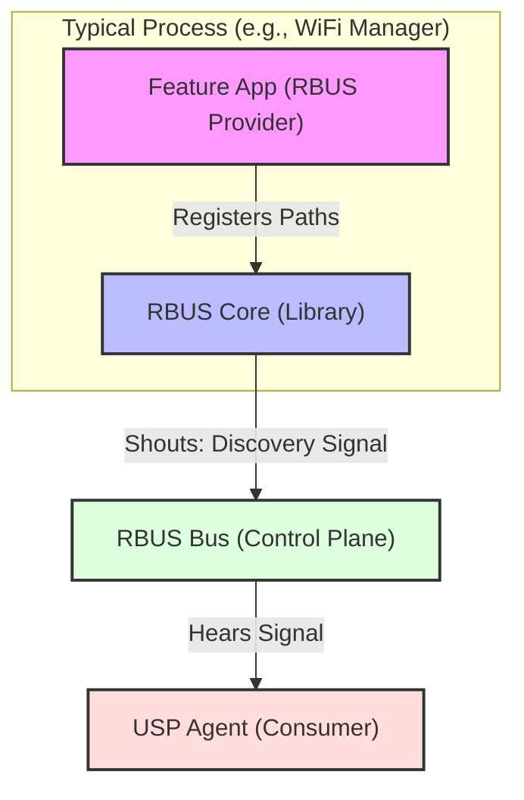
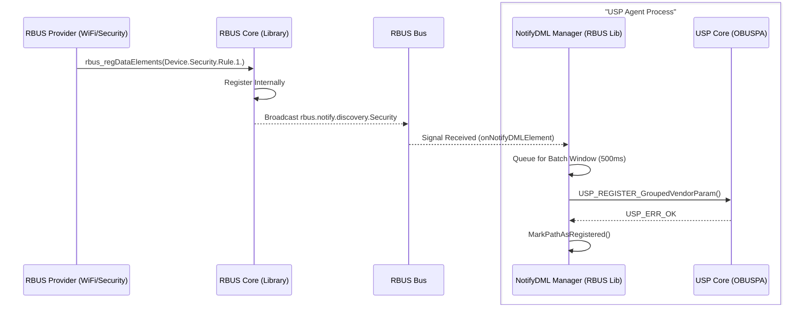
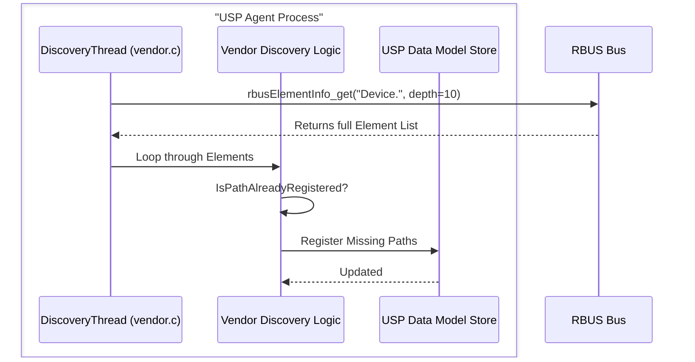

# RDK DM Discovery & NotifyDML - Technical Master Guide

This document provides a deep-dive into the architecture and implementation of the **RDK-USP Data Model Discovery Extension**. It covers the interaction between RBUS signals, the NotifyDML Manager, and the USP Agent.

---

## 1. System Architecture & Components

To understand this system, think of it as a conversation on a radio bus:



### A. The RBUS Provider (Component Layer)
Any CPE application (e.g., **WiFi Manager**, **Security Component**) that owns data model elements. 
*   **Example**: `Device.WiFi.Radio.1.` (owned by WiFi Manager) or `Device.Services.ProviderA.Data.`
*   **Action**: Calls `rbus_regDataElements`.
*   **Signal**: The **RBUS Core library** linked _inside_ the provider's process (not the central daemon!) automatically broadcasts the signal: `rbus.notify.discovery.<component_name>`. This is highly efficient as it eliminates a round-trip to the bus daemon for the announcement itself.

### B. The RBUS Core (Library Layer)
The low-level C library linked into every process. 
*   **Role**: It provides the transport mechanism. It is "unaware" of USP; its only job is to announce that a data model has changed within a specific process. For example, it detects when `Device.WiFi.` elements are registered and fires the broadcast.

### C. NotifyDML Manager (RBUS Library Layer)
A specialized engine developed to bridge RBUS and USP. 
*   **Role**: It sits inside the USP Agent, listens to discovery signals on the bus, and translates them into a format the USP Agent can process. For instance, when it hears a discovery signal from `ProviderA`, it triggers the USP registration for `Device.Services.ProviderA.*`.
*   **Ownership**: It belongs to the **RBUS source tree** (located in `rbus/src/rbus/`).
*   **Execution**: While it belongs to RBUS, it executes **inside the USP Agent process**. It spawns its own background thread within the Agent's memory space to handle queuing and batching.

---

## 2. Discovery Mechanisms: The "Dual-Path" Strategy

The system uses two parallel mechanisms to ensure no data model elements are missed.

### 2.1 Path A: Reactive (Event-Driven)

This is the primary way parameters are discovered during system runtime.

*   **Logic**: Based on the `rbus.notify.discovery` signal emitted by the **RBUS Core** library whenever a process registers new elements.
*   **Behavior**: It is instantaneous; new elements appear in USP within milliseconds of their creation on the bus.
*   **Purpose**: Handle dynamic changes, such as a new WiFi client joining or a security rule being added.



### 2.2 Path B: Proactive (Safety Fallback)

This is a background mechanism used to reconcile the data model. Even if all signals from Path A are missed, this path ensures the data model eventually reaches a consistent state.

#### **How it works on Boot**
1.  **Thread Launch**: Within `VENDOR_Init` (see `vendor.c`, function `VENDOR_Init`), the Agent spawns a dedicated `DiscoveryThread`.
2.  **Immediate Sweep**: The thread immediately executes a full data model sweep (`RDK_SyncDiscovery`). 
3.  **Boot Race Resolution**: This is critical for catching components that started and registered their elements *before* the USP Agent was fully initialized and listening for signals.

#### **Periodic Behavior**
*   **Scanning Interval**: After the initial boot sweep, the thread enters a loop that triggers a full reconciliation every **300 seconds (5 minutes)**.
*   **Reconciliation Logic**: It performs a wildcard query (`rbusElementInfo_get`) on `Device.`. If it finds an element on the bus that is NOT yet registered in the USP schema, it triggers the registration task.
*   **Auto-Persistence**: During the 5-minute idle period, the thread also monitors the state of the "Discovery Cache." If new elements were found via Path A, it handles auto-saving those changes to persistent flash memory after a short "cooldown" period.



---

## 3. Registration Flows

### **The "Single Item" Flow (Reactive)**
Used for real-time updates when a component adds a small number of elements (e.g., a new WiFi Radio).
*   **Mechanism**: Based on the `rbus.notify.discovery` signal.
*   **Code Reference**: `vendor.c::onNotifyDMLElement`
```c
req.handler = onNotifyDMLElement;
// Inside onNotifyDMLElement:
task->path = strdup(ev->path);
task->type = (int)ev->type;
USP_PROCESS_DoWork(dml_register_task_handler, task, (void*)1);
```

### **The "Storm" Flow (Batching)**
Used when a component (e.g., Security Firewall) registers hundreds of rules at once.
*   **Mechanism**: The NotifyDML Manager aggregates individual signals based on `batchWindowMs`.
*   **Code Reference**: `vendor.c::onNotifyDMLBatch`
```c
req.batchHandler = onNotifyDMLBatch;
// Inside onNotifyDMLBatch:
for (i = 0; i < batch->count; i++) {
    // Process multiple events in one context switch
    USP_LOG_Info("Event[%u]: path=%s", i, batch->events[i].path);
    // ... logic to aggregate additions into a single USP signal ...
}
```

---

## 4. Unregistration Handling (Crashes & Deletions)

The system handles both single unregistrations and massive "component gone" events, and reports back to callers using standard USP TR-369 error codes.

1.  **Single Unregister**: Handled via `RBUS_DMLNOTIFY_OBJECT_DELETION` signal in the batch handler.
2.  **Batch / Component Crash**:
    *   When `rbus_getExt` returns `DESTINATION_NOT_REACHABLE` / `DESTINATION_NOT_FOUND` / `TIMEOUT` / `BUS_ERROR`, `RDK_GetGroup` treats the provider as gone.
    *   It calls `PurgeComponentFromCache` (or `PurgeSchemaPath` when the component name wasn't resolvable at registration time) to remove the dead paths from both the vendor cache and the USP schema.
    *   A background task (`dml_resubscribe_task_handler`) then re-subscribes NotifyDML so that when the provider comes back, discovery events flow again.

### **USP Error Codes Returned to the Caller**

The vendor plugin maps RBUS-side failures to the standard USP error codes defined in TR-369, `usp_err_codes.h`:

| Caller action | Condition | USP error |
|---|---|---|
| `get Device.X_RDK_MassStress.Param_4` (specific path) | Provider dead, schema still contains the path (transient, before purge completes) | **`7016 USP_ERR_OBJECT_DOES_NOT_EXIST`** |
| `get Device.X_RDK_MassStress.Param_4` (specific path) | Path was already purged from the schema | **`7016 USP_ERR_OBJECT_DOES_NOT_EXIST`** (the broker translates the underlying `7026 USP_ERR_INVALID_PATH` to `7016` so callers see a consistent "object no longer exists" semantic) |
| `get Device.X_RDK_MassStress.` (wildcard / partial path) | Provider dead | **Silent** — dead entries are omitted and the background purge runs; the next read returns the pruned set cleanly |

### **Silent Purge Log Trail**

When a provider disappears, the obuspa log (`/var/log/obuspa.log`) contains the reconciliation trail:

```
DML Task: Re-subscribing to NotifyDML (post-purge refresh)...
DML Task: Re-subscribed to NotifyDML successfully
```

The wildcard GET returns nothing on stdout while this happens; specific-path GETs surface the standard `ERROR: 7016 …` line.

---

## 5. Implementation Reference (Current Architecture)

### **A. NotifyDML Manager (`rbus_datamodel_notification.c/h`)**
*   **Purpose**: A generic, reusable engine for RBUS to handle complex data model signals.
*   **Key Functions**:
    *   `rbusDataModelNotificationManager_Create`: Initializes the background thread and signal listeners.
    *   `dmQueueOrDeliver`: The core logic that decides whether to send a signal immediately or put it in a batch bucket.
    *   `dmThread`: Manages the timing for `batchWindowMs` and flushes the queue.

### **B. USP Agent Integration (`vendor.c`)**
*   **Purpose**: Connects the NotifyDML signals to the OBUSPA data model.
*   **Key Functions**:
    *   `VENDOR_Init`: Subscribes to `Device.` and sets thresholds (`500ms`, `maxBatchSize=100`).
    *   `dml_register_task_handler`: Safely switches from the RBUS background thread to the USP Main Loop to avoid thread-safety crashes.
    *   `PathToSchema`: Converts concrete paths (`Device.WiFi.Radio.1.`) to USP schema formats (`Device.WiFi.Radio.{i}.`).
    *   `RegisterPathRecursive`: Walks concrete and schema segments in parallel; for each `{i}` segment it calls `USP_DM_InformInstance` so obuspa's instance vector is kept in sync with live table rows (pure event-driven, no polling).
    *   `RDK_GetGroup`: Detects crashed providers, triggers cleanup, and schedules the post-purge NotifyDML resubscribe.
    *   `PurgeComponentFromCache`: Deregisters every schema path owned by a given RBUS component and marks the cache slots as free.
    *   `PurgeSchemaPath`: Per-path fallback used when the component name couldn't be resolved at registration time (`rbus_discoverComponentName` races during provider startup).
    *   `IsComponentAliveOnBus` / `ReconcileProvidersFromBus`: Lazy liveness probe used by the discovery-status getters so `DiscoveredProviders` / `ProviderCount` self-heal even when no GET ever hits the dead paths.

### **C. Build System (`CMakeLists.txt`)**
*   **Purpose**: Ensures all projects (RBUS, Vendor, OBUSPA) are linked correctly.
*   **Change**: Added `-DUSE_DISTINCT_DML_NOTIFY` and linked `librbus` to the USP Agent.

---

## 6. Optimization Logic

| Threshold | Parameter | Default | Behavior |
| :--- | :--- | :--- | :--- |
| **Time** | `batchWindowMs` | `500` ms | Flush the queue after 500ms of silence |
| **Count** | `maxBatchSize` | `100` items | Flush immediately if bucket reaches 100 items |
| **Coalesce** | `coalesceThreshold` | `1` | Drop intermediate value-change events for noisy params |

---

## 7. Manual Testing & Verification

Run these tests directly on the CPE (or in the dev container) using the tools available on the device.

---

### 7.0 Environment Setup (Dev Container)

#### Build the image _(first time only)_
```bash
# From the project root (the monorepo root containing rbus/ and usp-pa-vendor-rdk/)
cd /path/to/obusp_rbus

docker build -t rbus-dev -f usp-pa-vendor-rdk/Dockerfile .
```
> This compiles `obuspa`, `librbus`, and the `usp-pa-vendor-rdk` vendor plugin into one image.

#### Start the container
```bash
docker run -d --name rbus-dev rbus-dev
```
> The container `ENTRYPOINT` is `start_services.sh`, which automatically:
> 1. Cleans stale sockets and the USP database
> 2. Starts `rtrouted` (the RBUS message bus daemon)
> 3. Starts `obuspa` with the vendor plugin at verbosity level 3

#### Watch the live logs
```bash
# All logs (rtrouted + obuspa combined)
docker logs -f rbus-dev

# Discovery-only filter
docker exec rbus-dev tail -f /var/log/obuspa.log \
  | grep -E "DML Task|SyncDiscovery|batch|Re-subscrib|7016"
```

#### Open an interactive shell (to run test commands)
```bash
docker exec -it rbus-dev bash
```

#### Stop / reset the container
```bash
docker stop rbus-dev && docker rm rbus-dev
# Start fresh:
docker run -d --name rbus-dev rbus-dev
```

---

### 7.1 Test Path A — Reactive Discovery

**Goal**: Verify that a new provider registering on the bus immediately appears in the USP schema.

```bash
# Step 1: Watch the agent logs in real-time
tail -f /var/log/obuspa.log | grep "DML Task"

# Step 2: (in a second terminal) register a new component
rbusMassProvider 1 10
# This creates: Device.X_RDK_MassStress.10.*
```

**Expected logs:**
```
DML Task: Processing task for Device.X_RDK_MassStress.10. (type=0)
DML Task: Dynamically registering parent object Device.X_RDK_MassStress.10
```

**Verify via USP CLI:**
```bash
obuspa -s /tmp/usp_cli -c get Device.X_RDK_MassStress.10.
```

---

### 7.2 Test Path B — Boot Race (Proactive Sync)

**Goal**: Verify the boot sweep finds elements registered before the Agent started.

```bash
# Step 1: Stop the USP Agent
pkill obuspa

# Step 2: Register elements on the bus while Agent is down
rbusMassProvider 5 20 &

# Step 3: Start the Agent (adjust flags as needed for your platform)
obuspa -f -v 3 -i eth0

# Step 4: Watch for RDK_SyncDiscovery boot sweep in the logs
grep "SyncDiscovery\|DiscoveryThread" /var/log/obuspa.log
```

**Expected logs:**
```
DiscoveryThread: started
RDK_SyncDiscovery: found Device.X_RDK_MassStress.20.*
DML Task: Dynamically registering parent object Device.X_RDK_MassStress.20
```

---

### 7.3 Test Batching — The "Storm" (500 Registrations)

**Goal**: Confirm the NotifyDML Manager batches a large volume of signals instead of flooding the Agent.

```bash
# Trigger 500 registrations at once
rbusMassProvider 500 30

# Check the logs for batched delivery
grep "Received batch of" /var/log/obuspa.log
```

**Expected logs:**
```
onNotifyDMLBatch: Received batch of 100 DM Element discovery events
onNotifyDMLBatch: Received batch of 100 DM Element discovery events
onNotifyDMLBatch: Received batch of 100 DM Element discovery events
...  (5 batches total for 500 elements)
```

> [!IMPORTANT]
> If you see 500 individual `onNotifyDMLElement` lines instead of batches, the `batchWindowMs` or `maxBatchSize` configuration is not being applied. Check `VENDOR_Init` in `vendor.c`.

---

### 7.4 Test Crash Protection — Silent Wildcard, Error 7016 on Specific Paths

**Goal**: Verify the Agent cleans up the data model silently for wildcard reads, and returns the standard USP `7016 OBJECT_DOES_NOT_EXIST` for specific-path reads when a provider crashes.

```bash
# Step 1: Start a provider with 5 parameters
rbusMassProvider 5 5 &
PROV_PID=$!

# Step 2: Verify all 5 are visible
obuspa -s /tmp/usp_cli -c get Device.X_RDK_MassStress.

# Step 3: Kill the provider (simulate a crash)
kill -9 $PROV_PID

# Step 4a: Wildcard GET — expected to return nothing while the background purge runs
obuspa -s /tmp/usp_cli -c get Device.X_RDK_MassStress.

# Step 4b: Specific-path GET — expected to return the standard USP error
obuspa -s /tmp/usp_cli -c get Device.X_RDK_MassStress.Param_2
```

**Expected results:**

*Step 4a (wildcard):* empty output — the dead entries are silently omitted.

*Step 4b (specific):*
```
ERROR: 7016 retrieving Device.X_RDK_MassStress.Param_2 (Object does not exist)
```

**Expected logs in `/var/log/obuspa.log`:**
```
DML Task: Re-subscribing to NotifyDML (post-purge refresh)...
DML Task: Re-subscribed to NotifyDML successfully
```

---

### 7.5 Test Discovery Status Self-Healing

**Goal**: Verify that `DiscoveredProviders` / `ProviderCount` report live state even when a dead provider's paths are never read back.

```bash
# Spawn three providers
rbusTestProvider Device.X_RDK_Test.A Va &
rbusTestProvider Device.X_RDK_Test.B Vb &
rbusTestProvider Device.X_RDK_Test.C Vc &
sleep 5

# Check discovery status — expect 3 entries
obuspa -s /tmp/usp_cli -c get Device.X_RDK_DMDiscovery.ProviderCount
obuspa -s /tmp/usp_cli -c get Device.X_RDK_DMDiscovery.DiscoveredProviders

# Kill all three without reading any of their paths
pkill -9 -f rbusTestProvider
sleep 2

# Re-read — expect 0 entries (list self-heals via an RBUS liveness probe)
obuspa -s /tmp/usp_cli -c get Device.X_RDK_DMDiscovery.ProviderCount
obuspa -s /tmp/usp_cli -c get Device.X_RDK_DMDiscovery.DiscoveredProviders
```

**How it works:** `RDK_GetProviderCount` and `RDK_GetProviderList` call `ReconcileProvidersFromBus`, which snapshots the unique component names from the vendor cache and calls `rbus_discoverComponentDataElements` once per unique component. Components that no longer respond are fed to `PurgeComponentFromCache`, removing their schema paths and cache slots in one pass. Pseudo-components used for boot-loaded paths (`"static"`, `"persisted"`) and provenance-less entries (`"unknown"`) are treated as alive and never purged.

---

### 7.6 Quick Reference: Useful Log Filters

```bash
# Watch all discovery activity live
tail -f /var/log/obuspa.log | grep -E "DML Task|SyncDiscovery|batch|Re-subscrib|7016"

# Count how many paths were registered during a session
grep "MarkPathAsRegistered\|Marked dirty" /var/log/obuspa.log | wc -l

# Check current discovery status via USP
obuspa -s /tmp/usp_cli -c get Device.X_RDK_DMDiscovery.Status
obuspa -s /tmp/usp_cli -c get Device.X_RDK_DMDiscovery.LastSyncTime
obuspa -s /tmp/usp_cli -c get Device.X_RDK_DMDiscovery.DiscoveredProviders
obuspa -s /tmp/usp_cli -c get Device.X_RDK_DMDiscovery.ProviderCount
```


---

## 8. Subscription Flexibility & Scoping

The NotifyDML discovery engine is designed for extreme flexibility. You can restrict the range of discovery to optimize resources or filter out system-level components.

### **Restricting the Prefix (Scoping)**

By default, the Agent subscribes to `Device.` to find all possible components. However, you can change the `req.pattern` in `VENDOR_Init` to focus on a specific subtree:

```c
req.pattern = "Device.Services."; // Only discover Service components
```

### **Benefits of Scoping:**
1.  **Reduced Overhead**: The Agent ignores signals that don't match the prefix (e.g., system logs, internal stats).
2.  **Cleaner Data Model**: Filters out internal RBUS components that aren't relevant to a USP Controller.
3.  **Security**: Ensures specific subtrees (like `Device.Users.`) remain hidden if they don't have a standardized USP equivalent.

> [!TIP]
> **Proactive Sync Alignment**: If you change the subscription to `Device.Services.`, make sure to also update the proactive sync query in `RDK_SyncDiscovery` to use the same prefix for consistency between Path A and Path B.

---

## 9. Roadmap & Future Considerations

This section tracks planned optimizations and features intended for future RDK releases.

### **9.1 Resource Optimization: The Hash-Check Strategy**

Since **Path B** (`RDK_SyncDiscovery`) performs a full wildcard query of `Device.`, it can be CPU-intensive on high-parameter/low-memory CPEs.

*   **Objective**: Avoid unnecessary full-bus sweeps during periodic reconciliation.
*   **Proposed Logic**:
    1.  **Hash Discovery**: Introduce a "Local Revision ID" or "Global DM Signature" on the bus.
    2.  **Differential Sync**: Path B will first compare this Revision ID against its last cached state. If the IDs match, the Agent skips the expensive `rbusElementInfo_get` query entirely.
*   **Benefit**: Reduces Path B's idle CPU footprint by ~90% on resource-constrained devices.

### **9.2 Dynamic Scope Negotiation**

*   **Objective**: Allow the Agent to dynamically narrow its discovery scope based on the Connected Controller's needs (e.g., only discover WiFi if a WiFi-controller is active).

---

## 10. FAQ & Design Clarifications

This section addresses fundamental architectural questions regarding system safety, scalability, and dependencies.

**Q1: In the rbus daemon, when a component registers its data models, does the daemon publish an RBUS event?**

**Answer**: Specifically, the **RBUS Core Library** linked inside the provider process (e.g., `Device.WiFi.`) broadcasts the signal when `rbus_regDataElements` is called. This happens at the library level, not the central daemon (`rtrouted`), which makes the announcement instantaneous and eliminates an extra hop to the daemon for the signal's origin.

**Q2: Is a listener for this event implemented in the RBUS library... running in a thread?**

**Answer**: Correct. The **NotifyDML Manager** (the specialized "Scribe" thread) is part of the `librbus.so` codebase. However, it is **lazy-launched**. It only initializes and starts its background thread when the `rbusDataModelNotification_Subscribe` API is explicitly called by a consumer.

**Q3: The modified RBUS library is linked to every process. What prevents the thread being created in each process?**

**Answer**: **Execution Context Control**. While the code is in every process, the activation is not. In our architecture, only the **USP Agent (OBUSPA)** is programmed to call the subscription API. Every other process (WiFi Manager, Security Component, etc.) performs standard RBUS operations without ever triggering the NotifyDML Manager. Since they never "Subscribe," they never spawn the thread.

**Q4: Will building a process fail because the USP-PA API is not available?**

**Answer**: **No.** We use **Dependency Inversion (Function Pointers)**. The RBUS library (`librbus.so`) does not contain any hard links to `libobuspa`. Instead, the USP Agent injects its local registration functions (`onNotifyDMLElement`, `onNotifyDMLBatch`) as pointers during its subscription. Because the library only sees these as generic pointers, it has zero build-time or runtime dependency on the USP codebase.

**Q5: In a case of a CPE with 30+ components, do they need to change anything?**

**Answer**: **100% Zero Change**. The discovery broadcast is entirely internal to the RBUS library's registration function. Existing components simply use the same C code they've been using for years; they are **"Discovery-Agnostic"** and completely unaware that they are being announced to the USP data model.

---

### **The "Bigger Picture": Architectural Resilience**

Based on our design of **Boot Races, Batching, and Safety Fallbacks**, here is why this architecture is robust for real-world CPE environments:

*   **The "Boot Race" Resilience (Path B)**: Even if our reactive "Signal-Listener" (Path A) is perfect, there is always a risk that a component starts before the USP Agent is ready to listen. Our **Proactive Fallback (Path B)** in `DiscoveryThread` (running every 5 mins) ensures that even if a signal is missed during a messy system boot, the data model will eventually reconcile and become complete.
*   **Performance Protection**: By using batching and thread-safe task hand-offs, the system ensures that discovery "storms" never block the critical real-time operations of the USP Agent.

---
